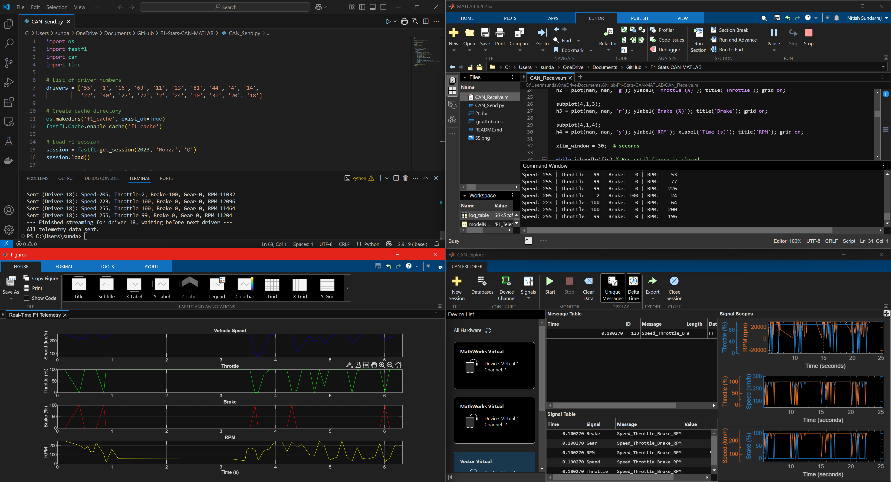

# 🏎️ F1 Telemetry Streaming over CAN Bus with Real-Time MATLAB/Simulink Visualization

This project simulates **Formula 1 car telemetry** data using [FastF1](https://github.com/theOehrly/Fast-F1), transmits it over a **virtual CAN bus**, and displays it in **real time** using MATLAB and Simulink.

### Python CAN Transmission Console  


## 🚦 Features

- Extract real F1 telemetry data from FastF1
- Transmit via Vector Virtual CAN channel using Python + `python-can`
- Receive and **plot in real-time** using MATLAB
- Simulink model for live signal scope / visualization
- Log data to CSV for later analysis

---

## 📦 Requirements

### Python
- Python 3.9+
- `fastf1`
- `python-can`

Install with:
```bash
pip install fastf1 python-can
